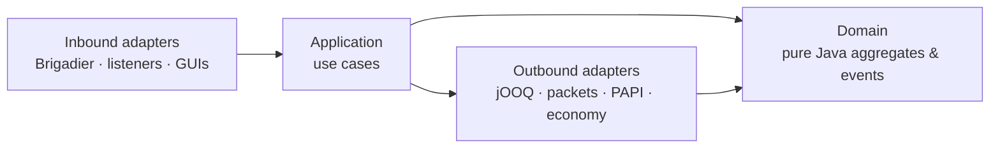

# uxmEssentials

[](LICENSE)
[](https://adoptium.net/)
[](https://papermc.io/)
[](https://docs.papermc.io/folia)
[](#modules)
[](#)

The all-in-one essentials suite for **Paper 26.1.2** servers, on **Java 25**. Homes, warps, teleports, a
real economy, kits, vaults, moderation, a staff mode, holograms, NPCs, scoreboards, a vote engine, multi-world
management — the entire day-to-day toolkit a survival or network server needs — built as **22 independent
feature modules** behind one clean, fully configurable plugin.

Every module is its own bounded context: turn one off and it wires *nothing* — no commands, no listeners, no
database tables, no runtime cost. Everything a player ever sees resolves through a per-locale message catalog,
so it can be re-worded or recoloured without touching code, and **every module ships with an in-game
management GUI** so you configure holograms, NPCs, warps, vaults, and moderation by clicking, not by editing
files.

It is built **Paper 26.1.2 only, on purpose** — current API used the way it is meant to be used,
**Folia-ready from line one**, balances and vaults **database-backed** so they survive world rollbacks, and
verified by Error Prone, NullAway null-safety, Spotless formatting, ArchUnit architecture rules, and an
extensive MockBukkit/JUnit test suite.

---

## Table of contents

- [Why uxmEssentials](#why-uxmessentials)
- [Requirements](#requirements)
- [Installation](#installation)
- [Modules](#modules)
- [Command cheat-sheet](#command-cheat-sheet)
- [Configuration](#configuration)
  - [Enabling & disabling modules](#enabling--disabling-modules)
  - [Renaming, aliasing & disabling commands](#renaming-aliasing--disabling-commands)
  - [Messages & localisation](#messages--localisation)
  - [In-game management GUIs](#in-game-management-guis)
- [Economy](#economy)
- [Storage](#storage)
- [PlaceholderAPI](#placeholderapi)
- [Migrating from another plugin](#migrating-from-another-plugin)
- [Cross-server & Discord add-ons](#cross-server--discord-add-ons)
- [Permissions](#permissions)
- [Architecture & quality](#architecture--quality)
- [Building from source](#building-from-source)
- [Versioning](#versioning)
- [Contributing](#contributing)
- [License](#license)
- [Acknowledgements](#acknowledgements)

---

## Why uxmEssentials

- **One platform, done well.** Paper 26.1.2 and Java 25 only — no legacy cross-version reflection to drag
  around, just the current server API used natively.
- **Genuinely modular.** Twenty-two feature modules, each toggled on its own. A disabled module instantiates
  zero adapters, registers zero commands and listeners, runs zero migrations, and holds zero state.
- **Configure in-game.** Every module has a management GUI reachable from `/uxmess gui` — edit a hologram, an
  NPC, a warp, a vault, or a punishment by clicking. The grids, slots, and icons are themselves config-driven.
- **Nothing hardcoded.** Every player-facing string lives in a per-locale catalog; every command can be
  renamed, aliased, or disabled; every GUI layout, cost, cooldown, and limit is a config value.
- **Rollback-proof data.** Economy balances and player vaults are stored in the database — never in item
  persistent-data — so a world rollback never duplicates money or items.
- **Folia-ready.** Nothing schedules through `BukkitScheduler`. A `Scheduler` port maps onto Paper's global /
  region / entity / async schedulers, so the same code runs unchanged on Folia.
- **Adventure-native.** All text is MiniMessage resolved through a shared style theme — no `§`/`&` colour
  codes anywhere.
- **Built on solid foundations.** Hexagonal (ports & adapters) with DDD bounded contexts; static analysis and
  architecture tests run as part of every build.

## Requirements

| | |
| --- | --- |
| Server | Paper **26.1.2** (build 71), or a Paper fork (Folia / Purpur / Pufferfish) |
| Java | **25** |
| Optional | PlaceholderAPI · Vault / VaultUnlocked / Treasury · a Votifier-compatible vote listener · LuckPerms |
| Clients | any version a server-side ViaVersion supports can connect — the **server** must be 26.1.2 |

> Spigot and CraftBukkit are **not** supported — uxmEssentials uses `paper-plugin.yml`, Brigadier, and
> bundled Adventure, which only Paper and its forks provide.

## Installation

1. Download `uxmEssentials-0.3.0.jar` and drop it in your server's `plugins/` folder.
2. Start the server once. uxmEssentials creates `plugins/uxmEssentials/` with a `modules.conf`, a per-module
   `config.conf`, the message catalogs, and the GUI layouts.
3. Edit what you want, then `/uxmess reload <module>` (or restart). That's it.

Two optional companion jars extend the suite onto other platforms — see
[Cross-server & Discord add-ons](#cross-server--discord-add-ons):

| Jar | Where it goes | What it adds |
| --- | --- | --- |
| `uxmEssentials-0.3.0.jar` | Paper `plugins/` | The plugin itself (required). |
| `uxmEssentials-velocity-0.3.0.jar` | Velocity `plugins/` | Cross-server sync of homes, warps, economy, and vote parties. |
| `uxmEssentials-discord-0.3.0.jar` | Paper `plugins/` | A JDA bridge for account linking and audit / economy notifications. |

## Modules

Every module is a self-contained bounded context, switched on or off in `modules.conf`. `economy` is the
worked multi-currency example; `vaults` and `economy` are database-backed so they survive rollbacks.

| Module | What it gives your server |
| --- | --- |
| **homes** | Slot-based home GUI — click an empty cell to set a home, click a home to teleport / rename / relocate / re-icon. Home visibility + invites (`/visit`, `/invite`), optional economy charge, a death-respawn chain (home → bed → spawn), unsafe / blacklisted-world guards, and land-claim gating across nine providers (Lands, GriefPrevention, uxmClaims, …). |
| **warps** | Server warps with per-warp cost, required permission, password lock, welcome message, warmup / cooldown overrides, departure / arrival sounds and particles, and a rating system. |
| **playerwarps** | Player-owned warps (`/pwarp`) with per-rank quotas, public / private visibility, password locks, visitor counts, and custom icons — all editable from a GUI. |
| **teleport** | `/tpa` · `/tpahere` · `/back` · `/rtp` (a pre-warmed, safe-search queue) · `/spawn`, with move-cancels-warmup, per-rank cooldowns, and configurable arrival sound / particle effects. |
| **economy** | Multi-currency, **database-backed** balances with `/pay` · `/balance` · `/baltop`, shared banks, loans, a currency exchange, physical banknotes, a Vault / Treasury provider, and per-rank limits via numbered permission nodes. |
| **kits** | An in-game kit editor with categories, cooldowns, one-time and first-join grants, costs, permission gating, and auto-equip — `/kit` opens a claim menu, operators edit it in place. |
| **vaults** | **Database-backed** player item storage (survives rollbacks) with per-player vault counts and per-vault sizes via quota nodes, an item blacklist, per-vault name & icon, overflow rescue, and inactive-vault purge. |
| **moderation** | Bans / mutes / kicks / warns / jails with silent sanctions, duration tiers, warn escalation, IP history and address-strictness, a unified `/history` · `/staffhistory` · `/checkban` · `/checkmute`, a management GUI, and a LiteBans importer. |
| **staff** | A dedicated staff mode: toggle with loadout swap, vanish, examine, freeze, follow, navigator, staff chat, an online-staff list, alerts, flight, sanction rollback, server lockdown, and targeted socialspy. |
| **messaging** | Private messages (`/msg`, `/r`), a mailbox (`/mail`) with offline-message fallback and `/mail sendall`, AFK notices, and a per-player ignore list. |
| **communication** | Server-wide announcements (multi-channel, scheduled, conditional, with placeholders), broadcasts, clear-chat, custom advancement notifications, and `/info` pages. |
| **presence** | Nicknames, presence status, and display-name management. |
| **playerstate** | Gamemode / heal / feed / fly / god / speed, and inventory inspection — `/invsee` and `/endersee`, offline-capable through a quarantined NMS seam. |
| **holograms** | `Display`-entity holograms: multi-line, multi-page (per-viewer click-to-cycle), provider-driven leaderboards, click-action chains, inline animations, per-player visibility and per-hologram blacklists, glow colour and opacity, link-to-NPC follow, plus FancyHolograms and DecentHolograms importers. |
| **npc** | Packet-based NPCs over an in-house, GPL-free packet layer — players, mobs, and display entities; skins by name / MineSkin / URL; click-action chains; equipment, glow, poses, and deep per-type variants; per-owner creation quotas and a command blocklist. |
| **scoreboard** | Per-player, condition-selected sidebars chosen by priority, with animated and conditional lines and hidden score numbers. |
| **tablist** | Per-player tab name formatting and sorting, animated header / footer, and fixed-slot layouts with filler entries. |
| **nametags** | Above-head nametags rendered through display entities — per-viewer, vanish-aware, with a separate view-range and cull distance. |
| **vote** | A full vote-rewards engine: Votifier intake, totals and a leaderboard, a config-driven reward engine, a cross-server vote party with escalation, voting streaks, per-site cooldowns and reminders, multi-channel broadcasts, and Discord webhook notifications. |
| **discordlink** | Link a Minecraft account to Discord, sync roles, and push audit / economy notifications (with the Discord add-on). |
| **itemworld** | The everyday item & world utility surface — item tools, virtual workstations, world cleanup, powertool, mob / entity controls, time / weather aliases, and admin-fun — split into independently disableable sub-feature groups. |
| **worlds** | A full multi-world manager: create / import / load / unload / delete (confirm-staged), per-world properties and gamerules, built-in void and flat generators, access gating with economy entry fees, cross-world portals, a world-editor GUI, pre-generation, backup / restore, and idle auto-unload. |

## Command cheat-sheet

The muscle-memory commands are all here, each renameable and aliasable from config:

```
Homes & warps   /home /sethome /delhome /visit /invite    /warp /setwarp /delwarp    /pwarp
Teleport        /tpa /tpahere /tpaccept /tpdeny  /back  /rtp  /spawn /setspawn  /tp /tphere
Economy         /balance (/bal) /pay /baltop /eco  /bank  /worth /sell   note
Kits & vaults   /kit /kits        /vault
Player state    /gm(s/c/sp/a) /heal /feed /fly /god /speed /more /repair   /invsee /endersee
Messaging       /msg (/w /tell) /reply (/r)  /mail   /afk   /ignore
Moderation      /ban /tempban /unban /mute /kick /warn /jail /history /checkban   /banip
Staff           /staff /vanish /freeze /staffchat (/sc) /stafflist
Worlds & more   /world /worlds   /hologram   /npc   /vote
Admin root      /uxmess  (aliases /uxmessentials /uxe)
```

The admin root drives the operator surface:

```bash
/uxmess reload <module>      # hot-reload one module's config, messages, and GUIs
/uxmess gui                  # open the management-GUI hub for every module
/uxmess import <source>      # one-shot, idempotent migration (see below)
/uxmess doctor               # health report: enabled modules, storage, integrations
```

## Configuration

The data folder is laid out per module, so a feature's geometry, costs, and copy live together:

```
plugins/uxmEssentials/
├── config.conf                  # shared settings (storage, locale, …)
├── commands.conf                # rename / alias / disable any command
├── messages/                    # messages_en.conf, messages_tr.conf, … (per-locale catalogs)
└── modules/
    ├── homes/{config.conf, gui/*.conf}     # config.conf carries the module's own `enabled` toggle
    ├── economy/{config.conf, gui/*.conf}
    └── …                                   # one folder per module
```

### Enabling & disabling modules

Each module owns its own `enabled` flag at the top of its `config.conf`. Switch it off and the module wires
nothing at all — no commands, no listeners, no tables:

```hocon
# modules/discordlink/config.conf
enabled = false
```

### Renaming, aliasing & disabling commands

Every command's label, aliases, and enabled state live in `commands.conf` — rename `/balance` to `/money`,
add the aliases you like, or switch a command off entirely:

```hocon
# commands.conf
commands {
  balance {
    name    = "money"
    aliases = ["bal", "cash"]
    enabled = true
  }
}
```

### Messages & localisation

Every player-facing line is a key in `messages/messages_<lang>.conf`, written in MiniMessage and resolved
through a shared style theme (one palette, consistent titles and prefixes). Ship a new locale by dropping in
`messages_<lang>.conf`; per-player locale is honoured automatically.

```hocon
"home.set.success" = "<prefix> <body>Home <value>{name}</value> set.</body>"
```

### In-game management GUIs

`/uxmess gui` opens a hub that links to every module's editor. Entity modules (holograms, NPCs, warps, player
warps, vaults, moderation) get a list → editor flow — pick an entity, then flip its properties with toggles,
steppers, text / number / enum editors, a colour picker, and list editors. Settings-style modules (teleport,
messaging, presence, scoreboard, …) get a panel of switches. The rows, slots, icons, and filler all come from
`modules/<module>/gui/*.conf`, so you can re-skin every menu without code.

## Economy

`economy` is the canonical worked example: a `Wallet` aggregate holds a balance per `Currency`, so the plugin
is multi-currency-capable while shipping one default currency out of the box. Balances are **DB-backed**
(never item persistent-data), so they survive world rollbacks. It registers a Vault / Treasury provider when
one is present — or runs on its own native provider — and gates limits through numbered permission nodes
(`uxmessentials.economy.balance.limit.<n>`). On top of the wallet sit shared banks, loans, a currency
exchange, and physical banknotes.

## Storage

SQLite is the default — zero setup, a single file under the data folder, WAL-mode and single-writer-safe.
Point it at a network backend to share state across a fleet — homes, warps, player-warps, economy, vaults,
moderation, holograms, NPCs, the vote party, and the messaging ignore list all replicate between nodes that
share one database:

```hocon
# config.conf
storage {
  backend = "sqlite"            # sqlite (default) | mysql | mariadb | postgresql
  # mysql { host = "..."  database = "uxm"  username = "..."  password = "..." }
}
```

The relational layer is HikariCP-pooled with Flyway migrations and a typed jOOQ DSL (no string-concatenated
SQL), with a Caffeine cache between the repositories and the database. Schema history self-heals on start, so
a cosmetic migration edit never blocks an existing database.

## PlaceholderAPI

With PlaceholderAPI installed, uxmEssentials exposes placeholders across every module — economy (per-currency
balances and indexed `baltop`), homes, presence and nicknames, teleport (cooldowns, back, requests),
moderation (ban / mute / freeze / warn state), vaults, kits, warps and player-warps, messaging, staff,
holograms, Discord links, and live server-metric tokens.

## Migrating from another plugin

`/uxmess import <source>` runs a one-shot, **idempotent** migration with a dry-run preview and a documented
conflict policy — so you can move an existing server over without starting from scratch:

| Source | Imports |
| --- | --- |
| EssentialsX | homes (into the slot model), warps, kits, economy |
| FancyHolograms · DecentHolograms | holograms |
| LiteBans | bans, IP-bans, mutes, warns |
| Vault · PlayerPoints | economy balances |

## Cross-server & Discord add-ons

Nodes that share one database stay in sync over a pluggable bus. A write on one server publishes a small
"this changed" notice that tells every peer to drop its cached copy and re-read the authoritative row — so the
database stays the single source of truth and a change never round-trips as a full payload. Pick the transport
in `config.conf`:

```hocon
# config.conf
network {
  enabled   = true
  server-id = "survival-1"      # unique per node; the origin tag on every change
  transport = "velocity"        # velocity | redis | both
  redis {
    host     = "127.0.0.1"
    port     = 6379
    password = ""
    db       = 0
    channel  = "uxmessentials:bus"
  }
}
```

- **Velocity** — drop `uxmEssentials-velocity-0.3.0.jar` on the proxy and the bus rides a proxy-side broker
  over plugin messaging.
- **Redis** — point `network.redis` at a Redis server and the same bus runs over Redis pub/sub with **no
  Velocity proxy required** — a plain set of backends sharing a database and a Redis instance sync directly.
- **both** — run both transports at once (handy mid-migration); a frame goes out on each.

Either way the sync covers homes, warps, player-warps, economy, vaults, moderation, holograms, NPCs, the vote
party, and the messaging ignore list. With no proxy, no Redis, and no peers the bus degrades cleanly to
local-only — the single-server path is unchanged. `/uxmess doctor` reports the active transport and its health.

- **Discord** — drop `uxmEssentials-discord-0.3.0.jar` on a Paper node to bridge account linking and push
  audit and economy notifications through JDA.

## Permissions

Permissions are tiered and quota-based: a feature root (`uxmessentials.home.*`), a module toggle, and numbered
quota nodes that resolve the highest a player holds — `uxmessentials.home.limit.<n>`,
`uxmessentials.warp.cooldown.<seconds>`, `uxmessentials.vault.amount.<n>`. The full node reference ships with
the plugin and is validated against the code by the build.

## Architecture & quality

uxmEssentials is **hexagonal (ports & adapters) with DDD bounded contexts**. The domain is pure Java — no
`org.bukkit`, no `net.kyori`, no SLF4J. Use cases orchestrate the domain through ports; adapters translate to
and from Bukkit at the edges; bootstrap wires everything, consulting a module registry so a disabled module
wires nothing.



- **Folia-ready** schedulers from line one; all I/O off the main thread.
- **Static analysis as errors** — Error Prone + NullAway (JSpecify `@NullMarked`), Spotless with Palantir
  Java Format.
- **Architecture tests** — ArchUnit fences the domain off from Bukkit, forbids `BukkitScheduler` and legacy
  command handlers, and keeps module boundaries clean. Drift guards keep the docs, permissions, and message
  catalogs in lockstep with the code.
- **Tests** — JUnit 5, AssertJ, Mockito, MockBukkit (Paper 26.1.2), Testcontainers, and jqwik property
  tests.
- Built on **[uxmLib](https://github.com/siracozmen01/uxmLib)**, the sibling toolkit that provides the GUI
  framework, item builder, config, storage, and the in-house packet layer.

## Building from source

Requires a JDK 25 toolchain (Gradle provisions one via the Foojay resolver if needed).

```bash
./gradlew build                       # compile, format check, static analysis, tests
./gradlew spotlessApply               # auto-format before checking
./gradlew check                       # full static analysis + test suite
./gradlew :bukkit-adapter:shadowJar   # the deployable plugin jar
./gradlew :bukkit-adapter:runServer   # start a Paper dev server
```

## Versioning

uxmEssentials follows semantic versioning. Pre-1.0 (`0.x`) releases may still adjust configuration and
behaviour between minor versions as the surface settles; the current release is **0.3.0**.

## Contributing

Issues and pull requests are welcome. The workflow is test-first: add a failing test, write the minimum
implementation, run `./gradlew spotlessApply` then `./gradlew check` green before committing. Keep to the
existing conventions — pure domain, constructor injection, MiniMessage for all text, and every player-facing
string behind a message key.

## License

[GPL-3.0](LICENSE) — © UXPLIMA.

## Acknowledgements

uxmEssentials is an independent implementation built on Paper, Adventure, and the open infrastructure stack
(HikariCP, Flyway, jOOQ, Caffeine, Configurate), on top of the [uxmLib](https://github.com/siracozmen01/uxmLib)
toolkit. The importers exist to make moving from an existing setup painless — the data formats they read are
acknowledged there, not borrowed from.
